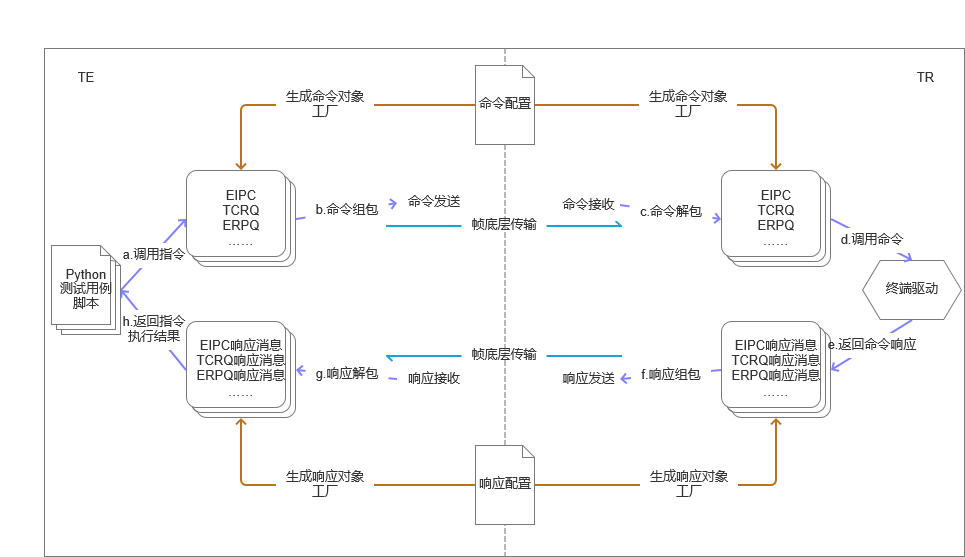

# Cmd Config

消息配置解析库

## 简介

消息配置解析库提供了一种通用、可拓展的消息描述方式，并可以读取用户自定义消息配置，实现消息对象到消息底层数据的双向转化。

消息对象工厂
- 消息对象工厂自动读取并解析消息配置，可以根据消息名或消息底层数据自动创建消息对象。

消息对象
- 消息对象是本项目对消息封装的最小独立单位。消息对象自描述，不同的消息被视为不同的对象自动解析与处理。

消息形态转化
- 消息底层数据 -> 消息对象：  
  消息对象工厂根据消息底层数据 (payload，载荷，网络直接传输的数据主体) 自动生成消息对象。
- 消息对象 -> 消息底层数据：
  用户可以根据消息名使用消息对象工厂创建不同的空消息对象，向对象写入数据，对象可以自动组包为 payload。

## 项目流程

1. 调用流程从 TE 端 Python 测试用例脚本开始，测试用例脚本调用某个虚拟指令(对象)，虚拟指令对象是一个指令对象的代理对象，代理指令的执行。
2. 虚拟指令对象使用解析了命令配置的消息对象工厂创建真实指令对象，实现命令的组包，并通过底层传输机制发送指令。
3. TR 端接收指令底层数据并解包为指令对象。
4. 指定对象调用实际的指令控制终端驱动。
5. 终端驱动返回指令的响应并被封装为虚拟响应消息对象（代理）。
6. 虚拟响应消息对象使用解析了响应配置的消息对象工厂创建真实响应消息对象，实现响应消息的组包，并通过底层传输机制发送响应。
7. TE 端接收响应底层数据并解包为响应消息对象。
8. 响应消息对象返回执行指令的结果。